# 概述

数学描述：为了一个优化目标，至少包含一块不规则形状的一组零件块必须以不重叠的结构排放在给定的放置区域内。

排样问题：如何将不规则的形状以最有效的布局旋转在一块或者多块材料上，保证没有重叠的，使得材料的利用率最大。

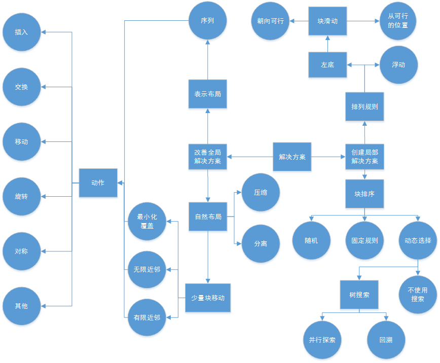

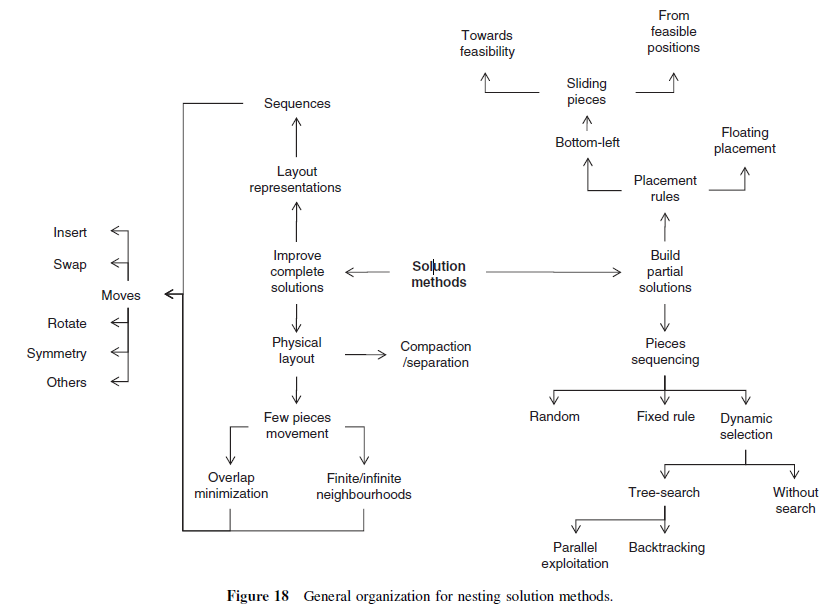

图1：排样解决方法的一般组织图[^Bennell,2009]

排样问题的最广泛的应用的启发式算法：左底排样算法。算法将形状逐个加入，尽量将形状放置到最左底的位置，通过这个方案可以得到初始解。

对左底排样算法的输出进行优化的两个主流算法：

1. 基于序列检索：即修改形状加入的序列以获得最优解
2. 基于布局检索：在获得初始解之后，直接对形状的位置进行修改，从而获得更优的解。

探索的算法：

1. 通过直接几何将其转化为整数规划问题
2. 对边界非直线情况的解决方案
3. 允许自由旋转的解决方案

# Ch01 几何基础

排样问题首先面对的是几何问题：在板材上两个给定位置的零件块，它们是否重叠、接触或者分离？解决这个问题的几个常用方法可参考综述[^Bennell,2008a]：

1. 栅格法（raster method）
2. 三角几何法（direct trigonometry)
3. 临界多边形（no-fit polygon, NFP）
4. φ函数（phi-function）

解决重叠问题的常用方法：临界多边形和三角几何。临界多边形比最快的三角几何算法还要快好几倍[^Burke,2007]。

## 1.1. 像素/栅格法

将连续的材料板分割成离散区域，使用矩阵表示网格，从而将几何信息简化为数据编码。

优点：在消除两个块的重叠或者识别非重叠的放置位置时，仅对网格中的单元进行计数。并且，栅格表示易于编码，可以像简单多边形一样轻松地表示非凸的或者复杂的零件块，并且在检查布局的几何可行性时速度相当快。

缺点：内在密集型方法，不能精确地表示具有非正交边的片段（使用锯齿状表示图形），提高精度就需要成倍地提高分辨率，$2n-1$级增加计算负担。

历史：

1. 由[^Oliveira,1993]提出了最简单的编码方案，使用0表示空白空间，使用1表示零件存在。对于布局的某个位置，矩阵中相应的单元格的值给出了占据这个位置的块的数量，如果该值大于1表示零件块之间发生了重叠。
2. 由[^Segenreich,1986]提出更加复杂的编码方案，使用1表示零件的边界，使用3表示零件的内部。观察矩阵中对应单元格的值，如果等于4表示边界与内部重叠，如果大于4表示内部与内部重叠，如果等于2表示两个零件接触。
3. 由[^Babu,2001]提出了有缺陷的不规则板材的编码方案，使用0表示零件内部，使用1表示从右边开始的轮廓值，然后从右到左按1累加。图中(a)表示有缺陷的不规则板材；(b)表示零件块；(c)表示放置了零件块的板材。这种方式利用使用左底算法。但是更加复杂。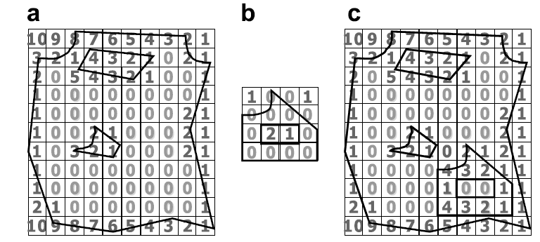

## 1.2. 三角几何法与$D$函数

使用多边形表示形状

优点：精度优于栅格方法(锯齿状)，信息量与顶点的数量成比例，并且不依赖于零件或者布局的尺寸。

缺点：

1. 检测可行性的时间是基于两个零件的边数的指数函数，而栅格法只是栅格尺寸的二次函数。
2. 每次改变多边形的位置时，都必须检测放置的可行性。因此，所有计算都必须从头开始，并在排样过程中执行搜索，不适合迭代搜索的排样算法。

检测两个多边形重叠的流程：

第一步：多边形的边界框是否重叠？

- 是的：应用第二步
- 不是：多边形没有重叠（见图6a）

第二步：对于来自不同多边形的每对边，它们各自的边界框是否重叠？

- 是的：对于所有重叠边应用第三步
- 不是：多边形没有重叠（见图6b）

第三步：对于来自不同多边形的每对边，通过边分析是否能表明相交？

- 是的：只要有一对边表明相交，则多边形相交
- 不是：应用第四步

第四步：对于其中一个多边形的每个顶点，其是否在另一个多边形内部？

- 是的：多边形相交（见图6d）
- 不是：多边形没有相交（见图6e）

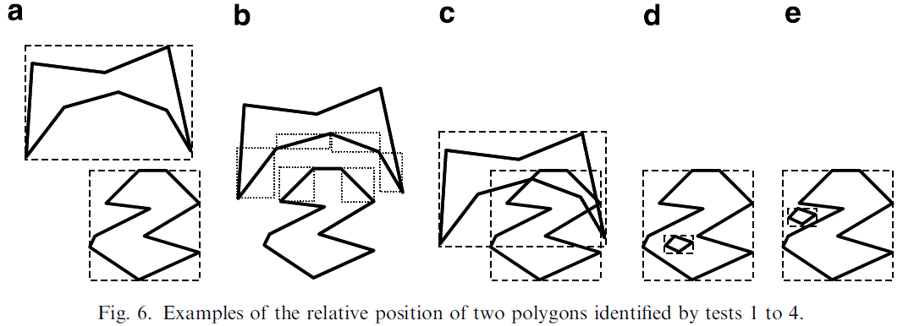

由[^Preparata,1985]为第四步提出了一个简单的点包含检测方法

由[^Konopasek,1981]为第三步提出了D函数：$D_{ABP}=((X_A-X_B)(Y_A-Y_P)-(Y_A-Y_B)(X_A-X_P))$来定义两边之间的关系。D函数给出了点P关于有方向的边$AB$的相对位置。函数是基于一点到一条直线的距离等式。这条线是无边界的，因为被称为边的支撑线。函数的解释：如果$D_{ABP}>0$，则点$P$在边$AB$的支撑线的左边；如果$D_{ABP}<0$，则点$P$在边$AB$的支撑线的右边；如果$D_{ABP}=0$，则点$P$在边$AB$的支撑线上。函数的解释还假设坐标系统的原点在左下角。

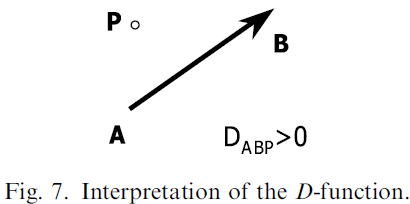

由[^Mahadevan,1984]使用$D$函数定义了两个有方向的边的相对位置。

## 1.2. 临界多边形（NFP）

NFP首先由[^Art,1966]提出，由[^Milenkovic,1992]推广，[^Burke,2007]给出伪代码。

NFP本质是一个多边形，通过一种方法组合两个多边形导出，NFP的内部表示两个多边形会发生重叠的相对位置，NFP的边界表示两个多边形会发生接触的相对位置，NFP的外部则表示它们是分离的。检测两个多边形是否重叠，只需要确定合成向量是否在NFP的内部，检测的复杂度为$O(n)$，其中$n$为NFP中的边的数量。

NFP的主要三种方法：

1. 轨道算法：由[^Mahadevan,1984]提出，由[^Whitwell,2005]改进
2. “Minkowski和”：由[^Ghosh,1991]提出，被[^Milenkovic,1991]和[^Bennell,2001]使用
3. 分解算法：[^Li,1995]分解星形，[^Watson,1999]和[^Agarwal,2002]分解凹多边形。

优点：NFP减少了识别两个多边形是否重叠的计算负担。大多数使用NFP的应用程序都会在预处理阶段计算所有零件对的NFP。相比栅格法精度更高，相比三角几何法速度更快。

缺点：为一般性的非凸多边形开发一个鲁棒的NFP生成器相对较难。

### 1.2.1. NFP 工作方式

给定两个多边形：$A$和$B$。形状$A$固定，形状$B$选择一个参考点（REF POINT），保持$A$与$B$的接触，通过环绕形状$A$的边界，即遍历形状$A$的边，跟踪参考点来生成$NFP_{AB}$。$NFP_{BA}$是$NFP_{AB}$旋转$180^\circ$。因此，NFP表达了两个多边形所有相交的位置。由[^Cuninghame-Green,1989]为纯凸多边形给出了计算NFP的简单算法，包括两个主要概念：

1. 固定多边形（$A$）是逆时针，轨道多边形（$B$）是顺时针
2. 两个凸多边形的NFP的边按斜率排序，输出NFP。

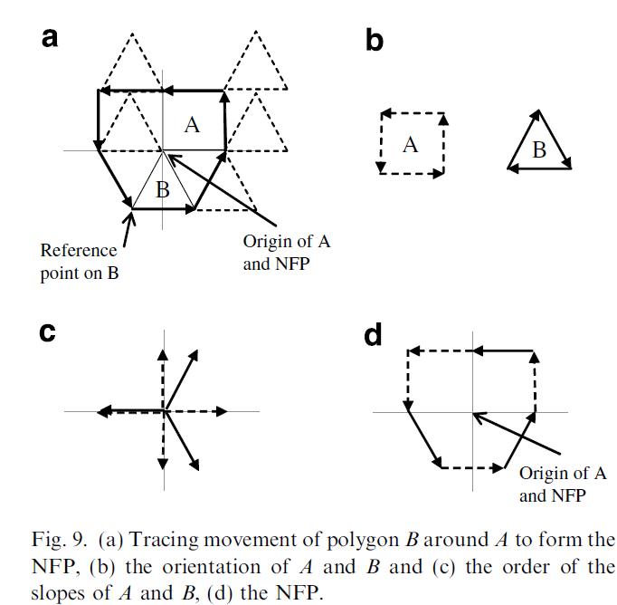

这些概念是理解[^Mahadevan,1984]和[^Ghosh,1991]方法的基础。但是以上方法都无法处理凹多边形。

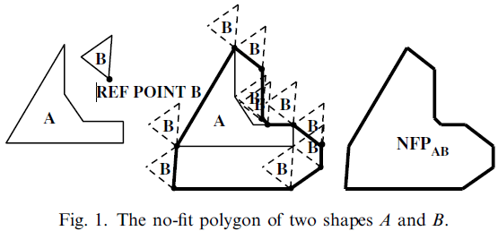

### 1.2.2. 滑动算法

由[^Mahadevan,1984]提出了一种滑动算法，对轨道多边形围绕固定多边形的运动进行建模工。为了确保算法没有从重叠点开始，轨道多边形（$B$）的最大y坐标被放置在为接触固定多边形（$A$）的最小y坐标。$B$上起始位置的参考点定义了第一个顶点。通过识别哪个基于顶点的成对边能够相互滑动，并且拥有合适的滑动距离，下述的每个顶点都被定义为逆时针方向。两者都是通过使用$D$函数确定的。

由[^Whitwell,2005]扩展的方法可以处理孔洞或者拟合点。当多边形的某条边在完成上述操作后没有被遍历，则说明存在孔洞。滑动算法在未遍历边上找到可行起始点，按顺时针方向执行滑动操作找到孔洞边界（或者内拟合多边形）。

由[^Burke,2007]提出了一个完整的解决方案，还对生成多边形的方式进行了修正（方法与[^Whitwell,2005]类似），使之更加简单高效。

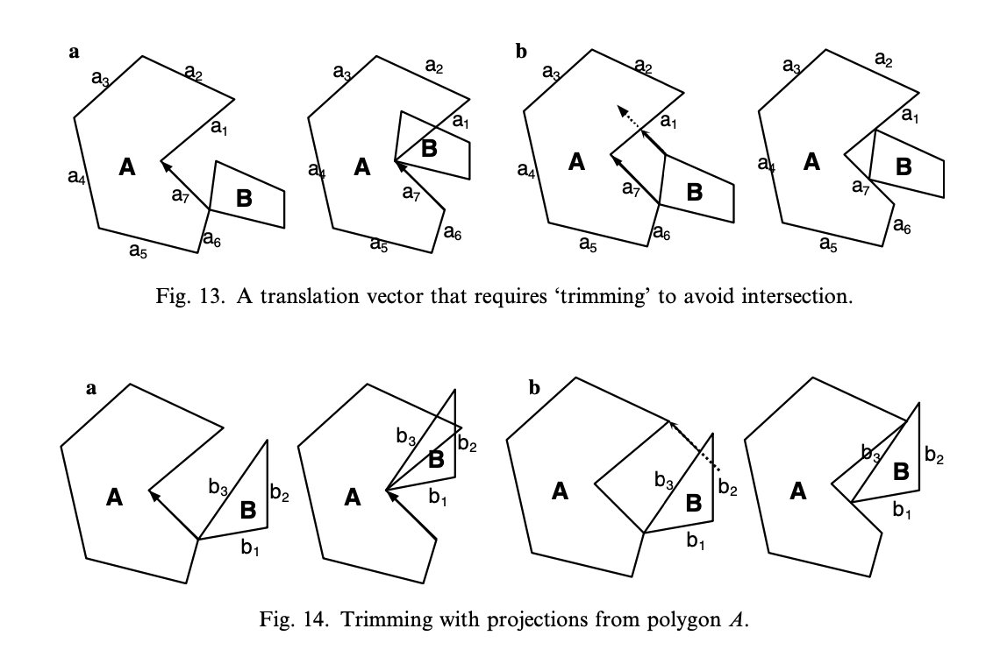

### 1.2.3. Minkowski和

“Minkowski和”的概念和理论属于形态学中更一般的领域，基于形态学操作来寻找NFP的方式称为膨胀。膨胀是通过与集合$B$的向量相加来扩大图像集合$A$，描述为$A/B$。膨胀操作也称为“Minkowski加”。

#### 在$R^2$上定义的“Minkowski加”

假定$A$和$B$是两个在$R^2$上任意的向量点的封闭集合，则“Minkowski和”的定义为
$$
S=A\oplus B=\{a+b|a\in A,b\in B\}
$$
集合的几何变换的并集可以被定义为“Minkowski加”：$S=A\oplus B=\cup_{b\in B}A_b$，其中$A_b$为集合$A$通过向量$b$的平移。由[^Stoyan,1977]首先将其形式化，在论文中进行了证明，并称为NFP为速度图。[^Milenkovic,1991]与[^Bennell,1998]也讨论了这种关系的证明，并且描述为“Minkowski差”。

由[^Bennell,2008b]提出了更加鲁棒的方法。不是生成凸包，然后修复生成的NFP，保留多边形的凹面，但是根据多边形凸凹性将其中一个多边形拆分为成组的序列边。每组可以单独与$A$的斜率图合并而没有冲突。因为这些组不是完整的循环，所以起始边必须是组中的$B$的第一条边。给定的组将被链接，有必要完成一个逆时针方向向前移动的组，相当于一个正的$B$边。因为$B$可能出现不止一次，所以领头的$B$边必须是正的，并且导致最终出现也是正的（例如：$+b_i,-b_i,+b_i$）。当组合合并列表时，需要包含链接边，以保持每个多边形中边的优先顺序。

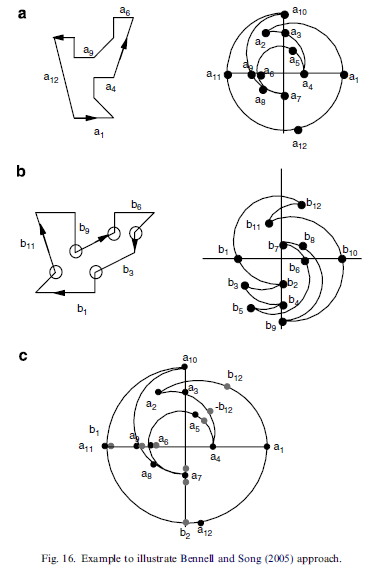

### 1.2.3. 原点

上述方法产生NFP的形状和方向，但是不产生它的位置。为了使用NFP来确定重叠，必须存在一个原点，以便从该原点测量每个多边形的位置。这个原点不能任意设置，而应该根据原始零件的原点来确定。

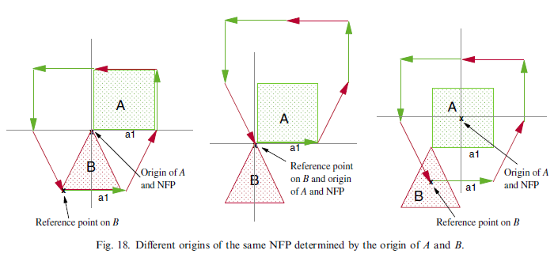

### 1.2.4. 分解算法

当两个多边形之间的凹面的相互作用导致获取NFP变得复杂，于是[^Watson,1999]和[^Agarwal,2002]提出了一个替代方法。

将简单的多边形分解成多个凸的子多边形，然后生成每对子多边形的NFP，确保每对子多边形中的成员来自不同的原始多边形。通过在凹顶点对之间进行分割，将一个简单的多边形分解成一组凸多边形。如果凸顶点的数目是奇数，那么最后的分割发生在一个凸顶点与一个凹顶点之间。每个子多边形的NFP可以通过前面描述的简单边排序过程来找。最后一步是将子NFP组合成一个多边形。合并过程需要识别所有的边相交，因为这些可能用于构造最终NFP的顶点，然后移除重复边（包含在一个或者多个子NFP的边不是边界的一部分）。

这种分解消除了当计算每对子多边形时对检测孔洞时的需要，有利于NFP的生成，但是也增加了分解和合并阶段的复杂性。

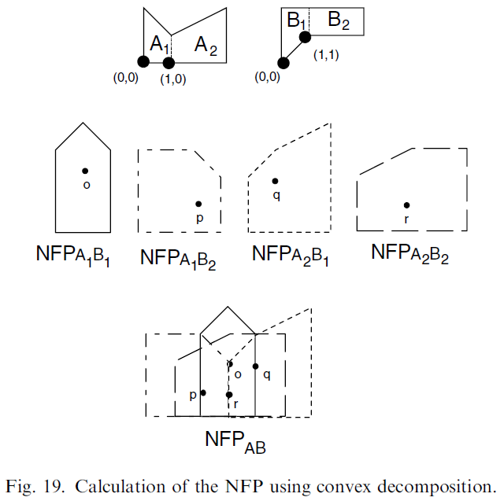

### 1.2.5. 总结

NFP是检测零件相对位置的有效工具，但是计算NFP则相对困难。Mahadevan的方法无法识别嵌套的位置，而嵌套会导致生成多重连接的NFP；Ghosh的方法解决了这个问题，但也因为大量的内部循环变得复杂。此外，一个零件精确匹配一个嵌套的凹面可以被定义为NFP内部的点或线，识别这种“循环”方向的机制主要依靠直接检测（[^Bennell,2008a],[^Whitwell,2005]）。

## 1.4. $\Phi$函数

$\Phi$函数方法首先由[^Stoyan,2001]提出。用于表示两个物体相互位置，具体值是两个物体之间的欧氏距离，或者是距离的估计值。

1. 如果两个对象是分离的，则$\Phi$函数的值大于零；
2. 如果两个对象是接触的，则$\Phi$函数的值等于零；
3. 如果两个对象是重叠的，则$\Phi$函数的值小于零。

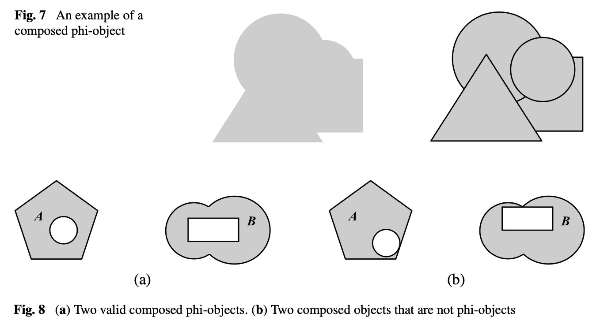

由[^Bennell,2008]推导了基础物体的$\Phi$函数输出值，基础物体包括：圆形、矩形、正多边形、凸多边形及这些形状的完整集。非基础形状可以表示为基础形状的并集和交集。

缺点：没有文献公布任意形状生成$\Phi$函数的算法过程。

# Ch02 基于序列检索

<!--ToDo:以下部分等待完善。。。-->

## 2.1. 左底填充算法

首先提出：[^Jakobs,1996]

参考论文：[^Dowsland,2002]

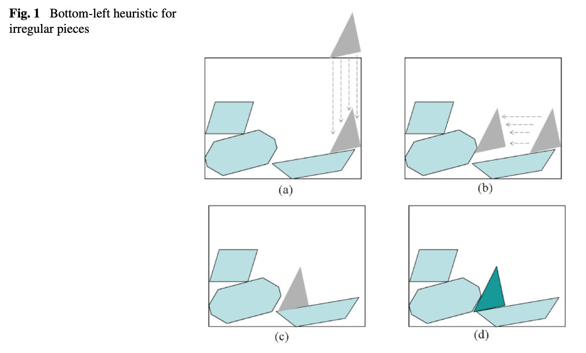

## 2.2. 精确匹配

## 2.3. 优化算法

### 2.3.1. 遗传算法

### 2.3.2. 模拟退火算法

## 2.4. TOPOS

### 2.4.1. 普通方法

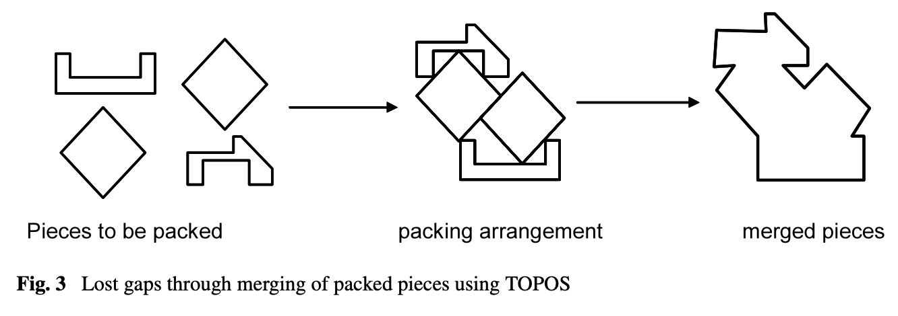

### 2.4.2. 柱搜索

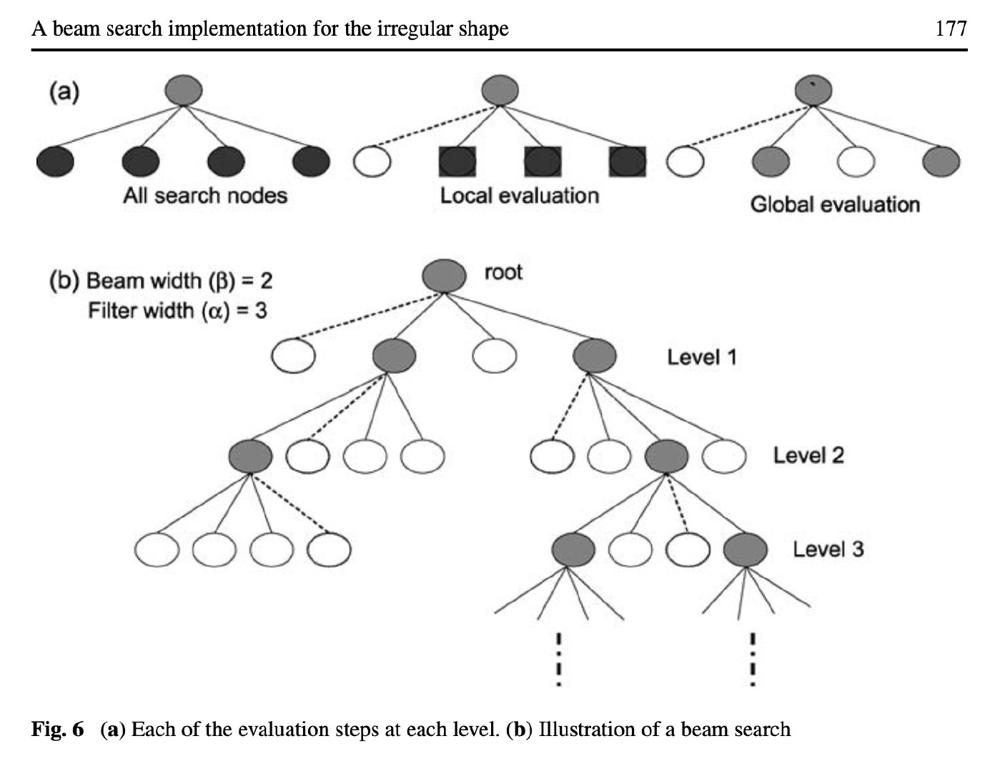

# Ch03 基于布局检索

## 3.1. 局部优化算法

### 3.1.1. 压缩

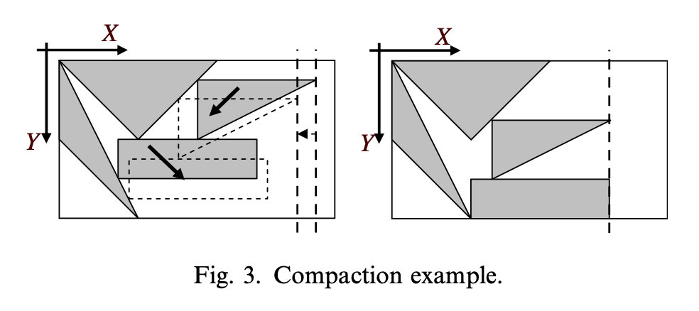

拆分

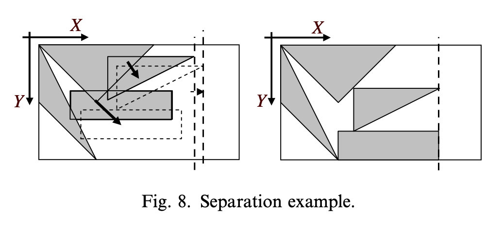

## 3.2. 快速局部检索

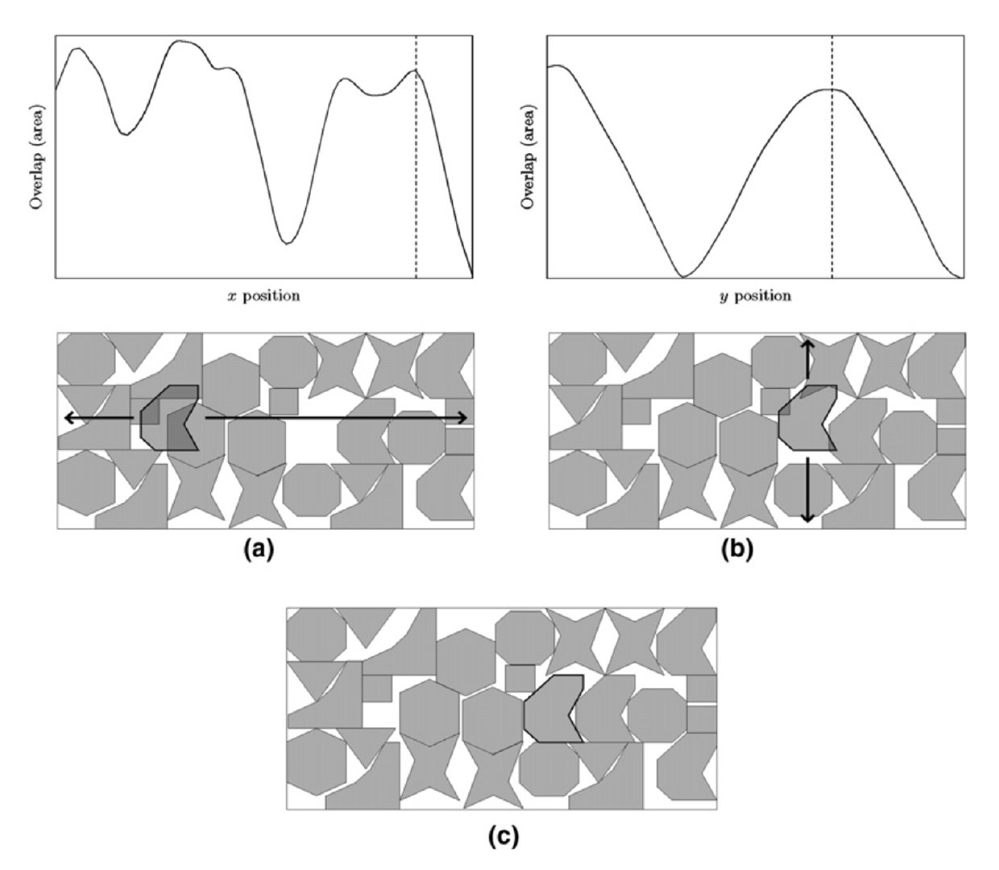

### 3.2.1. 收缩算法

Egeblad J, Nielsen B K, Odgaard A. Fast neighborhood search for two-and three-dimensional nesting problems[J]. European Journal of Operational Research, 2007, 183(3): 1249-1266.

## 3.3. 基于Cuckoo检索

Elkeran A. A new approach for sheet nesting problem using guided cuckoo search and pairwise clustering[J]. European Journal of Operational Research, 2013, 231(3): 757-769.

Yang X S. Nature-inspired optimization algorithms[M]. Elsevier, 2014

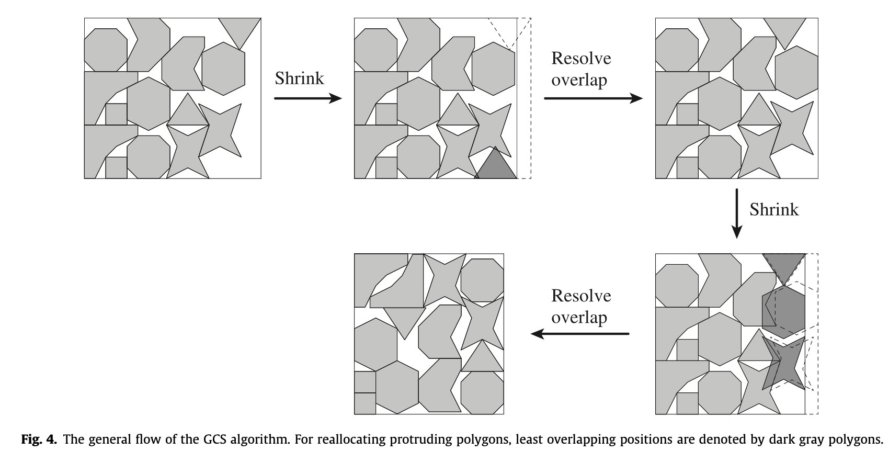

# Ch02 探索算法

## 2.1. 整数规划

## 2.2. 直接规划

## 2.3. 使用弧表示形状

## 2.4. 机器学习

## 2.5. 深度学习

### 基于 Pointer Network 解决 BLF 的组合优化问题

•[RL4CO，如何用强化学习解决组合优化？](https://zhuanlan.zhihu.com/p/129049617)

# 参考文献

•[排样问题文献综述](https://seanys.github.io/2020/03/17/排样问题综述/)

•[Data sets – ESICUP – EURO Special Interest Group on Cutting and Packing](https://www.euro-online.org/websites/esicup/data-sets/)

[^Agarwal,2002]:Agarwal P K, Flato E, Halperin D. Polygon decomposition for efficient construction of Minkowski sums[J]. Computational Geometry, 2002, 21(1-2): 39-61.
[^Art,1966]:Art Jr R C. An approach to the two dimensional irregular cutting stock problem[D]. Massachusetts Institute of Technology, 1966.
[^Arta,1966]:Art Jr R C. An approach to the two dimensional irregular cutting stock problem[D]. Massachusetts Institute of Technology, 1966.
[^Babu,2001]:Babu A R, Babu N R. A generic approach for nesting of 2-D parts in 2-D sheets using genetic and heuristic algorithms[J]. Computer-Aided Design, 2001, 33(12): 879-891.
[^Bennell,1998]:Bennell J A. Incorporating problem specific knowledge into a local search framework for the irregular shape packing problem[D]. University of Wales Swansea, 1998.
[^Bennell,2001]:Bennell J A, Dowsland K A, Dowsland W B. The irregular cutting-stock problem—a new procedure for deriving the no-fit polygon[J]. Computers & Operations Research, 2001, 28(3): 271-287.
[^Bennell,2008a]:Bennell J A, Oliveira J F. The geometry of nesting problems: A tutorial[J]. European journal of operational research, 2008, 184(2): 397-415.
[^Bennell,2008b]:Bennell J A, Song X. A comprehensive and robust procedure for obtaining the nofit polygon using Minkowski sums[J]. Computers & Operations Research, 2008, 35(1): 267-281.
[^Bennell,2009]:Bennell J A, Oliveira J F. A tutorial in irregular shape packing problems[J]. Journal of the Operational Research Society, 2009, 60(sup1): S93-S105.
[^Burke,2007]:Burke E K, Hellier R S R, Kendall G, et al. Complete and robust no-fit polygon generation for the irregular stock cutting problem[J]. European Journal of Operational Research, 2007, 179(1): 27-49.
[^Cuninghame-Green,1989]:Cuninghame-Green R. Geometry, shoemaking and the milk tray problem[J]. New Scientist, 1989, 123(1677): 50-53.
[^Dowsland,2002]:Dowsland K A, Vaid S, Dowsland W B. An algorithm for polygon placement using a bottom-left strategy[J]. European Journal of Operational Research, 2002, 141(2): 371-381.
[^Ghosh,1991]:Ghosh P K. An algebra of polygons through the notion of negative shapes[J]. CVGIP: Image Understanding, 1991, 54(1): 119-144.
[^Jakobs,1996]:Jakobs S. On genetic algorithms for the packing of polygons[J]. European journal of operational research, 1996, 88(1): 165-181.
[^Konopasek,1981]:Konopasek M. Mathematical treatments of some apparel marking and cutting problems[J]. US Department of Commerce Report, 1981, 99(26): 90857-10.
[^Li,1995]:Li Z, Milenkovic V. Compaction and separation algorithms for non-convex polygons and their applications[J]. European Journal of Operational Research, 1995, 84(3): 539-561.
[^Mahadevan,1984]:Mahadevan A. Optimization in computer-aided pattern packing (marking, envelopes)  [D]. North Carolina State University, 1984.
[^Milenkovic,1991]:Milenkovic V, Daniels K, Li Z. Automatic marker making[C]//Proceedings of the Third Canadian Conference on Computational Geometry. Simon Fraser University, 1991: 243-246.
[^Milenkovic,1992]:Milenkovic V, Daniels K, Li Z. Placement and compaction of nonconvex polygons for clothing manufacture[M]. Memorial University of Newfoundland, Department of Computer Science, 1992.
[^Oliveira,1993]:Oliveira J F C, Ferreira J A S. Algorithms for nesting problems[M]//Applied simulated annealing. Springer, Berlin, Heidelberg, 1993: 255-273.
[^Preparata,1985]:Preparata F P. Computational geometry: an introduction[R]. 1985.
[^Segenreich,1986]:Segenreich S A, Braga L M P F. Optimal nesting of general plane figures: A Monte Carlo heuristical approach[J]. Computers & Graphics, 1986, 10(3): 229-237.
[^Stoyan,1977]:Stoyan Y, Ponomarenko L D. Minkowski sum and hodograph of the dense placement vector function, SER[J]. Ukrainian SSR Acad. Sci., Ser. A, 1977, 10.
[^Stoyan,2001]:Stoyan Y, Scheithauer G, Gil N, et al. $\Phi$​-functions for complex 2D-objects[J]. Quarterly Journal of the Belgian, French and Italian Operations Research Societies, 2004, 2(1): 69-84.
[^Watson,1999]:Watson P D, Tobias A M. An efficient algorithm for the regular W 1 packing of polygons in the infinite plane[J]. Journal of the Operational Research Society, 1999, 50(10): 1054-1062.
[^Whitwell,2005]:Whitwell G. Novel heuristic and metaheuristic approaches to cutting and packing. School of Computer Science and Information Technology. University of Nottingham[D]. PhD Thesis, 2005.
