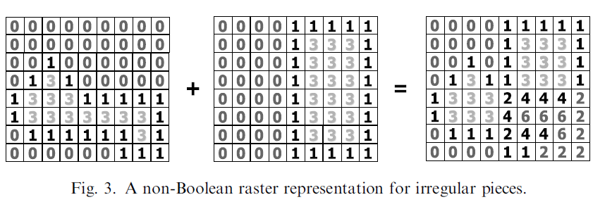

# 概述

数学描述：为了一个优化目标，至少包含一块不规则形状的一组零件块必须以不重叠的结构排放在给定的放置区域内。

排样问题：如何将不规则的形状以最有效的布局旋转在一块或者多块材料上，保证没有重叠的，使得材料的利用率最大。

图1：排样解决方法的一般组织图[^Bennell,2009]

排样问题的最广泛的应用的启发式算法：左底排样算法。算法将形状逐个加入，尽量将形状放置到最左底的位置，通过这个方案可以得到初始解。

对左底排样算法的输出进行优化的两个主流算法：

1. 基于序列检索：即修改形状加入的序列以获得最优解
2. 基于布局检索：在获得初始解之后，直接对形状的位置进行修改，从而获得更优的解。

探索的算法：

1. 通过直接几何将其转化为整数规划问题
2. 对边界非直线情况的解决方案
3. 允许自由旋转的解决方案

# Ch01 几何基础

排样问题首先面对的是几何问题：在板材上两个给定位置的零件块，它们是否重叠、接触或者分离？解决这个问题的几个常用方法可参考综述[^Bennell,2008a]：

1. 栅格法（raster method）
2. 三角几何法（direct trigonometry)
3. 临界多边形（no-fit polygon, NFP）
4. φ函数（phi-function）

解决重叠问题的常用方法：临界多边形和三角几何。临界多边形比最快的三角几何算法还要快好几倍[^Burke,2007]。

## 1.1. 像素/栅格法

将连续的材料板分割成离散区域，使用矩阵表示网格，从而将几何信息简化为数据编码。

优点：在消除两个块的重叠或者识别非重叠的放置位置时，仅对网格中的单元进行计数。并且，栅格表示易于编码，可以像简单多边形一样轻松地表示非凸的或者复杂的零件块，并且在检查布局的几何可行性时速度相当快。

缺点：内在密集型方法，不能精确地表示具有非正交边的片段（使用锯齿状表示图形）。

历史：

1. 提出了最简单的编码方案，使用0表示空白空间，使用1表示零件存在。对于布局的某个位置，矩阵中相应的单元格的值给出了占据这个位置的块的数量，如果该值大于1表示零件块之间发生了重叠。
2. 提出更加复杂的编码方案，使用1表示零件的边界，使用3表示零件的内部。观察矩阵中对应单元格的值，如果等于4表示边界与内部重叠，如果大于4表示内部与内部重叠，如果等于2表示两个零件接触。
3. 提出了有缺陷的不规则板材的编码方案，使用0表示零件内部，使用1表示从右边开始的轮廓值，然后从右到左按1累加。图中(a)表示有缺陷的不规则板材；(b)表示零件块；(c)表示放置了零件块的板材。这种方式利用使用左底算法。但是更加复杂。

## 1.2. 三角几何法与D函数

D函数首先由[^Konopasek,1981]提出，是表征两条边之间关系的有效工具，还可用于识别边的相交。

优点：表示的精度优于栅格方法

缺点：检查可行性的时间是基于两片的边的数量的指数级。

## 1.2. 临界多边形（NFP）

NFP首先由[^Art,1966]提出，由[^Milenkovic,1992]推广，[^Burke,2007]给出伪代码。

NFP本质是一个多边形，通过一种方法组合两个多边形导出，NFP的内部表示两个多边形会发生重叠的相对位置，边界表示两个多边形会发生接触的相对位置，外部则表示它们分离。

优点：NFP减少了识别两个多边形是否重叠的计算负担。大多数使用NFP的应用程序都会在预处理阶段计算所有零件对的NFP。

缺点：为一般性的非凸多边形开发一个鲁棒的NFP生成器相对较难。

生成方式：

给定两个多边形：$A$和$B$。形状$A$固定，形状$B$选择一个参考点（REF POINT），通过环绕形状$A$的边界，即遍历形状$A$的边，跟踪参考点来生成$NFP_{AB}$。

### 1.2.1. Minkowski和

“Minkowski和”首先由[^Bennell,2008b]提出。

### 1.2.2. 滑动算法

内拟合多边形[^Burke,2007]

### 1.2.3. 分解算法

## 1.4. $\Phi$函数

$\Phi$函数方法首先由[^Stoyan,2001]提出。用于表示两个物体相互位置，具体值是两个物体之间的欧氏距离，或者是距离的估计值。

1. 如果两个对象是分离的，则$\Phi$函数的值大于零；
2. 如果两个对象是接触的，则$\Phi$函数的值等于零；
3. 如果两个对象是重叠的，则$\Phi$函数的值小于零。

由[^Bennell,2008]推导了基础物体的$\Phi$函数输出值，基础物体包括：圆形、矩形、正多边形、凸多边形及这些形状的完整集。非基础形状可以表示为基础形状的并集和交集。

缺点：没有文献公布任意形状生成$\Phi$函数的算法过程。

# Ch02 基于序列检索

<!--ToDo:以下部分等待完善。。。-->

## 2.1. 左底填充算法

首先提出：[^Jakobs,1996]

参考论文：[^Dowsland,2002]

## 2.2. 精确匹配

## 2.3. 优化算法

### 2.3.1. 遗传算法

### 2.3.2. 模拟退火算法

## 2.4. TOPOS

### 2.4.1. 普通方法

### 2.4.2. 柱搜索

# Ch03 基于布局检索

## 3.1. 局部优化算法

### 3.1.1. 压缩

拆分

## 3.2. 快速局部检索

### 3.2.1. 收缩算法

Egeblad J, Nielsen B K, Odgaard A. Fast neighborhood search for two-and three-dimensional nesting problems[J]. European Journal of Operational Research, 2007, 183(3): 1249-1266.

## 3.3. 基于Cuckoo检索

Elkeran A. A new approach for sheet nesting problem using guided cuckoo search and pairwise clustering[J]. European Journal of Operational Research, 2013, 231(3): 757-769.

Yang X S. Nature-inspired optimization algorithms[M]. Elsevier, 2014

# Ch02 探索算法

## 2.1. 整数规划

## 2.2. 直接规划

## 2.3. 使用弧表示形状

## 2.4. 机器学习

## 2.5. 深度学习

### 基于 Pointer Network 解决 BLF 的组合优化问题

•[RL4CO，如何用强化学习解决组合优化？](https://zhuanlan.zhihu.com/p/129049617)

# 参考文献

•[排样问题文献综述](https://seanys.github.io/2020/03/17/排样问题综述/)

•[Data sets – ESICUP – EURO Special Interest Group on Cutting and Packing](https://www.euro-online.org/websites/esicup/data-sets/)

[^Arta,1966]:Art Jr R C. An approach to the two dimensional irregular cutting stock problem[D]. Massachusetts Institute of Technology, 1966.
[^Bennell,2008a]:Bennell J A, Oliveira J F. The geometry of nesting problems: A tutorial[J]. European journal of operational research, 2008, 184(2): 397-415.
[^Bennell,2008b]:Bennell J A, Song X. A comprehensive and robust procedure for obtaining the nofit polygon using Minkowski sums[J]. Computers & Operations Research, 2008, 35(1): 267-281.
[^Bennell,2009]:Bennell J A, Oliveira J F. A tutorial in irregular shape packing problems[J]. Journal of the Operational Research Society, 2009, 60(sup1): S93-S105.
[^Burke,2007]:Burke E K, Hellier R S R, Kendall G, et al. Complete and robust no-fit polygon generation for the irregular stock cutting problem[J]. European Journal of Operational Research, 2007, 179(1): 27-49.
[^Dowsland,2002]:Dowsland K A, Vaid S, Dowsland W B. An algorithm for polygon placement using a bottom-left strategy[J]. European Journal of Operational Research, 2002, 141(2): 371-381.

[^Jakobs,1996]:Jakobs S. On genetic algorithms for the packing of polygons[J]. European journal of operational research, 1996, 88(1): 165-181.

[^Konopasek,1981]:Konopasek M. Mathematical treatments of some apparel marking and cutting problems[J]. US Department of Commerce Report, 1981, 99(26): 90857-10.

[^Milenkovic,1992]:Milenkovic V, Daniels K, Li Z. Placement and compaction of nonconvex polygons for clothing manufacture[M]. Memorial University of Newfoundland, Department of Computer Science, 1992.

[^Stoyan,2001]:Stoyan Y, Scheithauer G, Gil N, et al. $\Phi$​-functions for complex 2D-objects[J]. Quarterly Journal of the Belgian, French and Italian Operations Research Societies, 2004, 2(1): 69-84.
