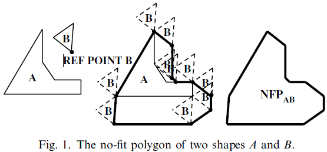

# 论文标题

参考论文：Burke E K, Hellier R S R, Kendall G, et al. Complete and robust no-fit polygon generation for the irregular stock cutting problem[J]. European Journal of Operational Research, 2007, 179(1): 27-49.

不规则下料问题中的完全的鲁棒的临界多边形生成

## 摘要

临界多边形是一种可以在成对的形状之间使用的构造方式，用于快速有效地处理不规则二维下料问题中的几何形状。以前，临界多边形（No-Fit Polygon，NFP）未能得到广泛的应用是因为缺乏处理所有问题的通用方案，而不是只能针对某个具体的需求。本文介绍了一种稳健的环形方法用于创建临界多边形，而且不会受到文献中其他方法遇到的典型问题。此外，这个算法只包含两个简单的几何过程，因此易于理解与实现。我们演示了该方法如何处理已知的退化情况，例如：孔洞、互锁凹面、锯齿类型的块，并且在文献中给出了32个不规则排样基准问题的生成时间，包括了真实世界的数据集，以便与现有的和未来的方法进一步比较。

### 关键词

切割，排样，临界多边形，环形方法

## Ch01 介绍

切割与排样问题的二维不规则变体影响了许多重要的制造业，如：纺织、塑料、金属切割等等。这些问题通常面对的是如何将许多不规则的零件以最有效的布局放置在一张或者多张材料上，以便所有零件都被指定，并且不会重叠。此外，由于问题的物理性质，例如：材质上的纹理、纺织品上的图案和所采用的切割技术，通常会对工件增加旋转约束。有些时候这类约束可以被用在非物理原因中，例如：将零件限制在有限的旋转集合中，从而简化布局的构建过程，并且允许获得更快的解决方案。二维下料问题已经被证明是NP难问题，因此本质上是很难解决的（Garey and Johnson, 1979）。有这么多不同的策略来解决不规则的块切割问题。这些方法包括线性规划方法、启发式布局方法、元启发式引导搜索技术和其他新颖的方法。例如：零件迭代挤压（Dowsland et al., 1998）。综述论文可见（Dowsland and Dowsland, 1992; Sweeney and Paternoster, 1992; Dyckhoff, 1990）。然而，连接所有方法的特征是它们都需要处理问题的几何开关。当使用高度不规则的形状（可能包括孔洞或者凹面）时，这可能特别复杂。鲁棒的并且有效的几何方法的实现可能是费力的，并且可能需要花费的时间比排样策略还多。具体来说，几何图形必须处理形状之间的所有交互，例如：检测两个形状是否重叠，并且计算沿给定方向所需要的移动距离，用于解决重叠问题。正如我们在下一节中所展示的，虽然这些检测可以使用三角函数来实现，但是临界多边形展现了一个更有效的解决方案。

在学术上，虽然临界多边形的生成具有挑战性，但它只是一个“工具”而不是“解决方案”，这可能是文献中这么多出版物在声明中使用临界多边形，但是在实现上只提供了很少的细节。在本文中，我们特别关注在临界多边形，并且提供了对历史技术的概述，以便用于形状的创建。此外，我们描述并且提供了实现一种新的鲁棒的环形方法的全部细节，这种方法可以解决其他方法无法处理的传统问题。希望这将帮助进一步传播使用临界多边形的优势（相比于传统的三角函数方法）。

## Ch02 临界多边形——概述

在本节中，我们描述了临界多边形的功能，并且将其与传统的基于三角函数的重叠和相交测试进行了比较。我们还简要概述了以前的文献中用于生成临界多边形的许多技术。

### 2.1 临界多边形

在切割和排样领域领域，Art(1996)首次提出了临界多边形技术，尽管使用的术语是“形状包络”。十年后，Adamowicz 和 Albano 提出了术语“临界多边形”，并且基于临界多边形将形状使用最小封闭矩形打包在一起来解决不规则的原料分割问题。术语“构型空间障碍”通常在工程或者机器人运动规划领域用于表示NFP，但是这个术语也被用于切割和排样（Cuninghame-Green, 1989）。“速度图”经常在数学界用于描述临界多边形（Stoyan 和 Ponomaarenko, 1977; Scheithauer 和 Terno, 1993; Bennell 等, 2001）。临界多边形的主要功能是描述两个多边形的相差区域。下面的示例概述了NFP的构造。

给定两个多边形：$A$和$B$，一个形状可以通过环绕另一个形状的边界来寻找临界多边形。其中一个多边形的位置保持固定，另一个多边形沿着固定多边形的边缘遍历，同时确保两个多边形始终接触但是从不相交。在本文中，我们采用了第一个多边形是固定的，第二个多边形是移动或者环绕多边形。因此，当多边形$B$沿着固定多边形$A$勾勒轮廓时，输出的临界多边形记为$NFP_{AB}$。为了创建$NFP_{AB}$对象，我们必须从$B$中选择一个参考点，当$B$环绕$A$时参考点将被跟踪。在实现中，我们使用形状的顶点列表中的第一个顶点作为参考点（见图1）。参考点可以是任何点，只要它能够跟随环绕多边形支行。保持参考点相对于多边形$B$的相对位置也很重要，因为NFP测试重叠时需要使用。

图1：两个形状$A$和$B$的临界多边形

为了测试多边形$B$是否与多边形$A$重叠，我们使用了$NFP_{AB}$和$B$的参考点。如果多边形$B$的位置使其参考点位于多边形$NFP_{AB}$的内部，则其与多边形$A$重叠。如果多边形$B$的参考点在$NFP_{AB}$的边界上，则其与多边形$A$接触。如果多边形$B$的参考点在$NFP_{AB}$的外部，则其与多边形$A$没有重叠与接触（见图2）。文献中以下论文（Grinde 和 Cavalier, 1995; Ramkumar, 1996; Cheng 和 Rao, 1997; Dowsland 等, 1998, 2002; Milenkovic, 1999; Gomes 和 Oliveira, 2002）使用了临界多边形。

图2：在多边形$A$和$B$之间使用临界多边形检测相交性

### 2.2 在重叠检测上对比临界多边形与标准三角几何

尽管临界多边形是成对多边形之间进行相交检测的优秀工具，但是在文献与现实世界的制造产业中，它还没有被广泛应用到二维排料问题中。毫无疑问，这是因为临界多边形的实现困难与缺乏可用的鲁棒的算法。相反，许多相交的实现使用标准的三角几何方法，特别是，这种方法出现实际应用的排料软件中，在这种情况下，分布式软件能够完全正确地处理所有可能的多边形就显得极为重要。然而，这两种方法虽然它们的总体效果相同，但是使用临界多边形的程序会比效率最高的三角几何的程序还要快好几倍。例如：我们希望尝试同一布局问题的多次迭代，预生成的临界多边形可以显著减少总计算时间。在多次迭代中，在重复的方向和位置上，三角几何方法可能会重复检测和解析相同的重叠形状。当一个排料的重叠解析方法需要计算两个相交形状的所有相交点时，临界多边形方法的优势将进一步增强，因为当使用三角几何方法时，为了满足检测冲突的需要，将会执行大量的相关计算。因此，通过使用临界多边形，我们可以将重叠检测问题（这是排料过程中影响计算的主要因素）的计算成本减少不对劲多边形检测中成本明显较低的点上（Dowsland 等, 2002）。除此之外，当 Burke 等人使用重叠分辨技术时（待出版），通过重复分辨y轴方向上的相交边来分辨相交形状，通过使用临界多边形的分辨技术将 更加有效，在一次完整的移动中就可以解析y轴上的重叠。此外，临界多边形还允许在任意方向上通过从相关的参考点投射出一条射线，并且找到与临界多边形边界最近的交点来解决重叠问题。在下一节中，我们比较了用于检测和解决两个多边形之间重叠问题的几何过程，首先，使用标准三角几何，其次，使用临界多边形（NFP）。给定一个排料方法，假设多边形$A$有$7$条边，多边形$B$有$6$条边，我们希望检测两个多边形$A$和$B$的所有交点（见图3），因此每条边都会与其他的边进行检测，共进行42次检测用于确定相交的状态。此外，如果我们没有找到相交点，为了消除两个多边形穿过顶点相交的可能性，我们必须对两个形状上的所有点执行点内检测，这一共需要13次检测，因此在最坏的情况下总共需要55次检测。

图3：使用临界多边形实现的相交性检测

对于通过三角几何方法检测布局中任意两个多边形之间的交集，以上这些检测可以被视为一个很大但是不可避免的开销，而且开销会随着多边形数量的增加而变大。虽然可以尝试许多搜索方法，还可以开发快速的次库，但是交集检测仍然是生成排料解时计算开销的相当大的一部分。此外，当我们希望使用搜索方法来开发大量的解决方案时，这些经常重复性的计算将对整体的计算时间产生相当大的影响。

现在回到图3，两个多边形的临界多边形$NFP_{AB}$也显示在问题空间的某个任意位置。在这种情况下，使用提出的“边滑动”技术生成的$NFP_{AB}$，其中多边形$B$穿过多边形$A$上的边，并且通过穿过多边形的参考点$REF_B$来形成$NFP$。在创建NFP的笛卡尔空间中的坐标不会影响基于相交检测来使用$NFP$，因为我们可以基于参考点，简单地根据$NFP$的位置生成正确的检测点（test point, tp）：$tp=REF_{NFP_{AB}}+REF_B-REF_A- Offset$，其中$Offset$是从多边形$A$（固定多边形）的参考点到临界多边形（$REF_{NFP_{AB}}-REF_{A}$）的参考点的向量。关于$NFP_{AB}$检测点（tp）的状态可以使用 O'Rourke(1998) 中描述的射线交叉算法计算。如果检测点（tp）在$NFP_{AB}$内，则多边形$A$和$B$相互发生碰撞。碰撞意味着两个多边形相交或者一个多边形在另一个内部。如果检测点（tp）在$NFP_{AB}$上，则两个多边形接触。如果检测点（tp）在$NFP_{AB}$外，则两个多边形既没有接触也没有碰撞。通过计算所有的成对多边形的全部临界多边形，当执行多重迭代排样时，我们可以显著地节省计算时间。
