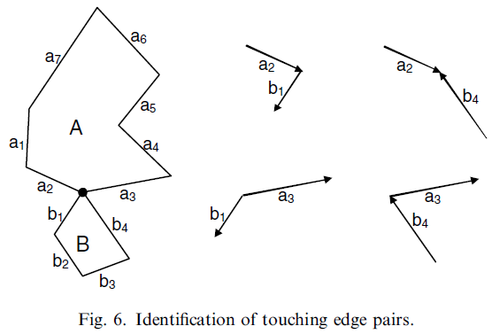

# 摘要

临界多边形（No-Fit Polygon, NFP）是一种可以在成对的形状之间使用的构造方式，用于快速有效地处理不规则二维排料问题中的几何形状。

一种鲁棒的轨道方法用于创建临界多边形，能够处理其他文献中所提方法遇到的典型问题的影响，例如：孔洞、互锁凹面、拼图类型的块。。只包含两个简单的几何过程，易于理解与实现。

# Ch01 介绍

排样问题就是如何将许多不规则的零件以最有效的布局放置在一块或者多块材料上，保证所有零件都被排样，并且相互之间不会重叠。

解决重叠问题的两个常用方案：临界多边形和三角几何，前者更加有效。

本文首次提供了新的鲁棒的轨道生成方法的全部细节。

# Ch02 临界多边形——概述

## 2.1. 临界多边形（NFP）

临界多边形的主要功能是描述两个多边形的相交区域。

给定两个多边形$A$与$B$。固定形状$A$，从形状$B$中选择一个参考点，使形状$B$沿着形状$A$的边缘勾勒轮廓，即遍历形状$A$的所有边，跟踪参考点输出临界多边形$NFP_{AB}$，遍历时确保两个多边形始终接触但是从不相交。

两个多边形的三种状态：相交（Intersection）、接触（Touching）、非相交（No Intersection）

## 2.2. NFP与标准三角几何在重叠检测上的对比

临界多边形比最快的三角几何算法还要快好几倍。

如果检测点（tp）在$NFP_{AB}$内，则多边形$A$和$B$发生碰撞，即两个多边形或者相交，或者一个多边形在另一个多边形的内部。

如果检测点（tp）在$NFP_{AB}$上，则多边形$A$和$B$发生接触。

如果检测点（tp）在$NFP_{AB}$外，则多边形$A$和$B$既没有接触也没有碰撞。

## 2.3. 构造NFP的方法

### 2.3.1. 凸多边形

NFP生成的基本形式：两个多边形都是凸的。

给定两个凸多边形$A$和$B$，通过以下步骤创建临界多边形：

1. 逆时针确定形状$A$的方向，顺时针确定形状$B$的方向（见图4a）；
2. 将$A$和$B$的所有边移动到一个点（见图4b）；
3. 沿逆时针顺序连接这些边产生临界多边形（见图4c）。

凸的临界多边形生成算法是基于标准排序算法与通过平移实现的边再排序相结合，其优点是简单，速度快。缺点是无法对非凸的形状生成对应的临界多边形，并且凸包的简化导致凸的部分在排料中是无效的。

2.3.2. 非凸多边形

从非凸形状中生成临界多边形的方法分为三大类：分解、“Minkowski和”、轨道方法。

#### 2.3.2.1. 分解

将非凸形状分解成更容易“管理”的子块，因此需要创建多个临界多边形。为了相交检测，临界多边形保持分解状态。对单个临界的多边形可以进行相交计算，再计算重组怕分成，代价随着分解数目的增长而呈非线性增长。

2.3.2.1.1. *凸块*

将非凸形状分解成凸块方法的主要问题：分解和重组算法。任何不规则的多边形被分解成凸块，就可以通过将形状$B$的每个凸块环绕形状$A$的每个凸块来生成临界多边形。

缺点：凸块的临界多边形可能交叉，重组构建临界多边形时必须小心。如果原始形状包含孔洞，则会因为相交的临界多边形的子块无法对孔洞进行明确定义。

2.3.2.1.2. *星形多边形*

星形多边形的属性：至少存在一个内部点或者“核心点”，通过“核心点”可以“看到”多边形的整个边界。星形多边形介于凸与非凸形状之间，在“Minkowski和”的运算下是“闭合”的，并且两个星形多边形在“Minkowski和”的方法下也会产生星形多边形。

2.3.2.1.3. $\phi$*函数*

$\phi$函数定义了成对的标准对象或者“主要”对象（如：矩形、圆形、凸多边形）之间的数学相交关系，通过对主要对象的并、交、补来定义非凸多边形的数学相交关系。在布局生成过程中，两个形状的合成相交检测是通过比较所有成对的主要对象的$\phi$函数来执行的，这些成对的主要对象用于定义形状$A$和形状$B$。$\phi$函数是基于主要对象之间的距离函数构造的，可以用来寻找两个复杂对象之间距离。

$\phi$函数不属于临界多边形的方法。

#### 2.3.2.2. Minkowski 和

NFP的构造可以使用“Minkowski 和”进行统一，定义如下：给定两个任意点集$A$和$B$，则两个集合的“Minkowski 和”为
$$
A\oplus B=\{a+b:a\in A,b\in B\}
$$
最基本的NFP构造方式中使用的是“Minkowski 差”：$A\oplus -B$。即形状$A$置于逆时针方向，形状$B$置于顺时针方向。这类方法的非数学实现较少，并且只能工作在两个形状的凹面之间互不干涉或者不互锁，也不能处理内部的孔洞。

#### 2.3.2.3. 轨道滑动方法

由Mahadevan的博士论文首次提出，利用轨道方法来产生“包络”。方法的关键是：如何计算接触顶点和接触边、如何确定平移向量、如何计算平移长度。

Mahadevan将“D函数”检测修改用于计算接触点；然后，利用这个信息基于接触边选择平移向量；然后，通过轨道形状的每个顶点对平移向量进行投影；然后，使用相交边检测计算平移距离。

将平移向量投影到固定多边形的反方向；然后，轨道形状沿着平移向量平移最小的距离（从投影和相交检测）。这样确保了两个多边形从不相交，但是总保持接触。这个过程持续进行，直到轨道多边形返回到其原始的起始位置。（详述参考第3节）

缺点：不能为包含了孔洞或者一些凹面的形状生成完整的临界多边形。

# Ch03 NFP构造算法

## 3.1. 概述

方法分为两个阶段：

1. 第3.2.节描述第一个过程，一个多边形环绕另一个多边形滑动，以创建两个形状的临界多边形的外部路径
2. 第3.3.节描述第二个过程，使用起始位置，允许算法找到临界多边形的剩余路径

## 3.2. 轨道与滑动

算法的轨道运动（或者滑动）的目的：检测多边形$B$是否围绕多边形$A$执行了正确的运行，以便返回其原始的位置。这是一个迭代过程，每个平移步骤都会创建一个临界多边形的边。这个过程细分为以下子部分：

1. 检测接触边
2. 创建潜在的平移向量
3. 寻找可行的平移向量
4. 修剪可行的平移向量
5. 应用可行的平移向量

3.2.1. 检测接触边

每一对接触边与接触顶点的位置存储在一起。

### 3.2.2. 创建潜在的平移向量

将多边形$B$平移去轨道化多边形$A$所使用的向量必须根据具体情况从多边形$A$的或者多边形$B$的边中推导出来。图7展示了每种情况的例子。

使用成对的接触边可以得到潜在的平移向量的集合，每一对接触边产生一个潜在的平移向量。成对的接触边的类型：

1. 两条边在一个顶点接触
2. 轨道边的一个顶点接触固定边的中间
3. 固定边的一个顶点接触轨道边的中间

表1：当两条边在顶点接触时，推导出潜在的平移向量

| 案例 | 固定多边形接触边的顶点 | 轨道多边形接触边的顶点 | 轨道边相对于固定边的相对位置 | 平移向量的导出来源 |
| ---- | ---------------------- | ---------------------- | ---------------------------- | ------------------ |
| 1    | 起始顶点               | 起始顶点               | 左侧                         | 轨道边             |
| 2    | 起始顶点               | 起始顶点               | 右侧                         | 固定边             |
| 3    | 起始顶点               | 终止顶点               | 左侧                         | -                  |
| 4    | 起始顶点               | 终止顶点               | 右侧                         | 固定边             |
| 5    | 终止顶点               | 起始顶点               | 左侧                         | -                  |
| 6    | 终止顶点               | 起始顶点               | 右侧                         | 轨道边             |
| 7    | 终止顶点               | 终止顶点               |                              | -                  |
| 8    |                        |                        | 平行                         | 固定边+轨道边      |

情况说明：

1. 在表中的案例7中，因为固定多边形的和轨道多边形的边都接触到了终止顶点，因此不能导出平移
2. 在案例3与4中，轨道多边形的边在它的终止顶点接触，因此不能从轨道多边形的边中导出平移
3. 在案例5与6中，固定多边形的边在它的终止顶点接触，因此不能从固定多边形的边中导出平移
4. 在案例3与5中，轨道多边形的边在固定多边形的边的左侧，因此不能导出平移

### 3.2.3. 寻找可行的平移向量

从潜在的平移向量集合中选择不会导致直接相交的可行的平移向量。

