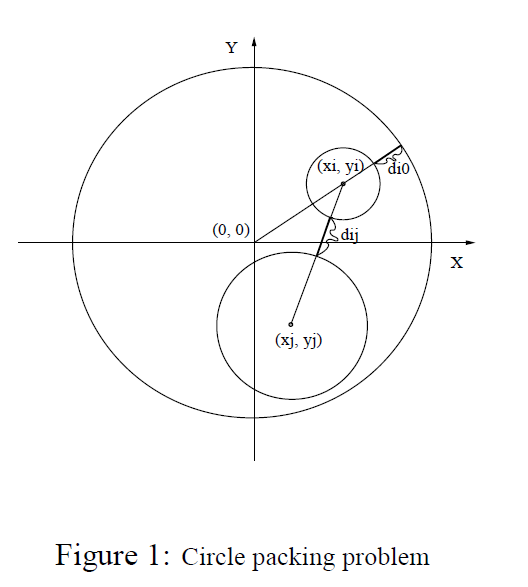
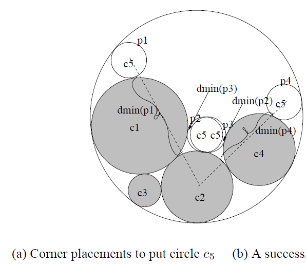
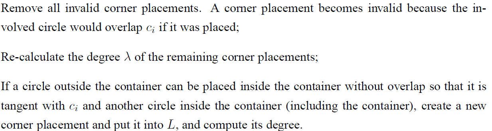

1.  圆盘坐标为$(0,0)$，半径为$r_0$，圆形物体$c_i$，半径为$r_i$，坐标为$(x_i,y_i)$，要保证圆形物体之间不相交，所以需要满足：

$$
\begin{equation}
	r_0-r_i-\sqrt{x_i^2+y_i^2}\geq0,i\in\{1,\cdots,n\}
\end{equation}
$$

$$
\begin{equation}
	\sqrt{(x_i-x_j)^2+(y_i-y_j)^2}-r_i-r_j\neq0,i\neq j,j\in\{1,\cdots,n\}
\end{equation}
$$

上式中，约束1满足圆形物体ci一直在圆盘内而不至于超出圆盘，约束2满足圆盘内的物体彼此之间不重叠。

2. 圆盘内的两个物体$c_i$、$c_j$之间的距离为

$$
d_{ij}=\sqrt{(x_i-x_j)^2+(y_i-y_j)^2}-r_i-r_j
$$

3. 圆盘内物体$c_i$距离容器的距离$d_{i0}$的距离：

$$
d_{i0}=r_0-r_i-\sqrt{x_i^2+y_i^2}
$$



4. 算法A1.0涉及到的概念介绍：
   1. 配置C(Configuration)。它表示先至少将m(m\>=2)个圆形物体没有重叠的放入圆盘，剩下n-m个圆形物体等待放入。如果最后m=n，则说配置成功，否则配置失败。
   2. M是已经放置到容器里的圆形物体的集合。
   3. 角位置(corner placement)。给定一个配置C，一个corner placement表示将某个圆形物体Ci放入圆盘，它不会与M中的物体重叠，但至少会与其中两个物体（其中一个物体可以是圆盘自身）同时相切（这两个物体之间不一定相切），一个corner placement用一个三元组P(ci,x,y)表示，表明物体ci被放入(x,y)位置。(因为与至少两个物体相切，所以能算法(x,y)的值)。
   4. 孔度(hole degree)。它是用于评估将一个圆形物体放入圆盘内的收益(benefit)。一个corner placement p(ci,x,y)被定义为：$\lambda=(1-\frac{d_{min}}{r_i})$。其中，$r_i$ 是圆形物体$c_i$的半径，$d_{min}$是$c_i$到M内(不包括与之相切的两个物体)其他圆形物体的最小距离。也就是说，当$d_{min} =
      0$时，孔度为1；而如果孔度为1，则说明放置当前物体后所浪费的空间是最小的。
   5. MHD规则（maximal hold degree）：选择具有最大孔度的corner placement
      $p(c_i,x,y)$放入圆盘中。


A1.0算法如下：

先放入两个物体到圆盘中，这两个物体需要保证彼此相切而且也都与圆盘相切，通过这个操作生成了初始的配置(configuration)。在这个初始的配置下，对于等待放入的每个圆形物体，A1.0算法通过计算它的孔度，然后选择最大的孔度去放置这个物体，放置操作为p(ci,x,y)。如果所有物体都放入到圆盘后，则算法成功返回，否则失败。

算法设定

corner placement list L

Configuration C

在放置一个物体ci 后，L做如下修改：



算法伪代码如下：

```pseudocode
Procedure A1.0(I)
Begin
	for k:=1 to n-1 do
		for l:=k+1 to n do
			generate an initial configuration C using circles k and l;
			generate the corner placement list L;
			if (A1.0Core(C,L) rerturns a successful configuration) then stop with success;
	stop with failure;   
End.
Procedure A1.0Core(C,L)
Begin
	while (there are corner placements in L) do 
		for every corner placement p(ci,x,y) do
			benefirt(p(ci,x,y)):=lambda;
		select the corner placement p(ci,x,y) with the maximum benefit;
		modify C by placing ci at (x,y);
		modify L;
	return C;
End.
```

