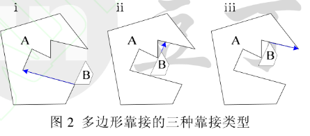

临界多边形NFP：参考论文《改进临界多边形生成算法》杨卫波等

定义：给定多边形A和B，将多边形A固定，然后用多边形B作不旋转的刚体运动绕多边形A环形运动一周，运动过程中B保持和A接触但不重叠，则B上的某个参考点在运动过程中所形成的轨迹就构成了B相对于A的NFP，记为NFPAB。

几何意义：

1.当多边形B的参考点位于NFPAB上时，多边形B和A接触但不重叠。

2.当参考点位于NFPAB内部时，B和A不重叠。

3.当参考点位于NFPAB外部时，B和A不接触也不重叠。

移动碰撞法生成NFP：其基本原理时保持多边形A固定不动，根据A和B当前时刻的靠接状态，得出B下一步的可移动方向和可移动距离，将B移动到新的位置，然后重复以上移动过程，直至绕完A一周回到初始位置，整个过程AB相接触，但互不重叠。具体算法可以分为如下5个步骤：

1.  多边形靠接位置检测。设多边形A、B均为逆时针方向，得到A在Y方向上的最低顶点作为起始点，设为A0，如果有多个最低顶点，取X坐标最小的一个顶点作为起始点。同理获得B的最高顶点B0，并将B0作为B的第一个顶点，同时也作为移动过程中的参考点。算法迭代开始前，移动B使得B0和A0重合。算法每次迭代时，都需要对多边形A、B的当前靠接状态进行检测，在B绕A运动过程中，A、B之间的靠接状态可分为3种情况：

    1.  A的顶点和B的顶点相接触

    2.  A的顶点和B的边接触

    3.  B的顶点和A的边接触

        

2.  求解移动方向。确定了多边形A、B当前靠接状态后，就可以判别在每个靠接点位置时，多边形B的备选移动方向。举例：

    

    a)
    A、B顶点相接触且方向向量a到方向向量b的夹角小于180度，也就是二者的叉积Z分量大于0，则移动方向为a。

    b) a向量到b向量叉积Z分量小于0，则移动方向为-b。

    c) 如果B的顶点和A的边接触（包括B的边与A的边接触），则移动方向为a。

    d)
    如果A的顶点和B的边接触，此种情况相当于多边形A相对向量b移动，但A必须保持固定，因此B的移动方向为-b。

    综上可知，移动方向要么是a向量方向，要么在a的分量方向。

3.  确定可移动向量。

    并不是每一个靠接位置按照确定好的移动方向都是可以移动的。下图中a3和b1（之所以是b1而不是b4是因为b4向量的终止方向与多边形A相交，会产生覆盖）确定的靠接位置按照移动方向a3移动的话，会导致a4和b4向量相交，因此这样的靠接位置应该排除。

    

    对于一个可移动的向量来说，它必须对所有多边形A、B的靠接边都是可以移动的。对靠接的禁止移动范围，依旧有顶点与顶点、顶点与边等4种情况：

图中的圆弧所表示的角度范围为可移动向量的禁止移动方向。当可移动向量方向在此角度范围内时，必然会引起a,b向量发生碰撞。所以每次都需要计算所有靠接点在当前选择的移动方向向量上移动是否会发生碰撞，如果发生碰撞，则判断当前靠接点的下一个靠接点的移动方向向量，然后继续开始判断是否会发生碰撞。

1.  计算最小移动距离。在确定多边形B的移动方向后，为防止移动过程中发生碰撞，还需要计算A和B在给定方向上的最小碰撞距离，计算方法为：

    1.  计算B的各个顶点在给定方向上到A的各边的距离，并取其中的最小距离MindistBA。

    2.  计算A的各个顶点在给定方向的负方向上到B的各边的距离，并取其中的最小距离MindistAB。

    3.  取MindistBA与MindistAB的最小值作为最小移动距离。

        

        对顶点沿着移动方向到边的距离的计算，有如下便捷算法：

        假定P1为多边形B上一顶点，移动方向为向量P1P2，线段P1P2与多边形A的交点如下：

        

        多边形A由顶点集Ai(Xi,Yi)组成，P1 (x1,y1),P2(x2,y2)。

        定义变量：
        $$
        S_i=D(A_i,P_1,P_2)=
        \begin{vmatrix}
        	X_i&x_1&x_2\\
        	Y_i&y_1&y_2\\
        	1&1&1
        \end{vmatrix}
        $$
        则有：
        
        a)若A中两个连续的顶点的Si符号相同且Si不等于0，说明这两个连续顶点在线段P1P2的同侧，与线段P1P2没有交点。
        
        b)若Si符号相反且Si不等于0，则两点在线段两侧，与线段P1P2有交点。
        
        c)若两点的Si至少有1个0时，则点在线段所在的直线上，可通过坐标范围进一步判断点是否在线段上。
        
        d)求出多边形各顶点的Si值，那么S中总的符号改变次数即为多边形与线段的交点个数。在以后计算交点时，则只计算Si符号改变时多边形的边与线段的交点，对于其他的边则不需要计算，从而快速求出多边形顶点到边的距离。
        
        5.
        根据向量移动多边形。按照得到的可移动向量的方向和最小碰撞距离，可确定平移向量，再根据参考点可得出基于参考点的平移。将多边形B进行平移操作，并保存移动向量。

6\. 迭代上述过程，直到B参考点回到最初的位置。

7\. 最后将各次迭代中保存的向量首尾相接，形成的多边形就是NFPAB。

排样顺序策略：

1.  fist
    fit：先以零件的高度、宽度或面积等为排序依据，对未排序列表中的样件进行排序。在开始排样后，每次都遍历未排样样件列表，选择列表中第一个可排放入容器的样件。

2.  best
    fit:它也是先对样件进行排序，在选择样件进行排样时，遍历未排样列表，从中选择放入容器中最合适的样件。最合适的判定条件可以为当前样件放入后当前总利用率最高。

    建议采用best fit策略，每次排样顺序都以提高利用率为目的。
